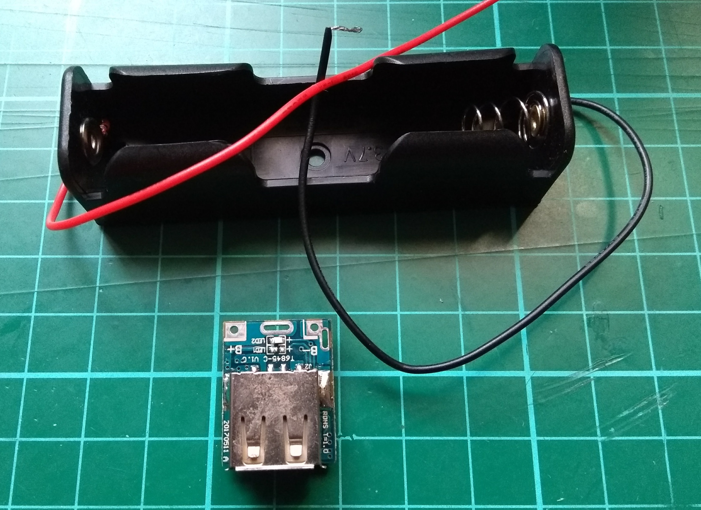
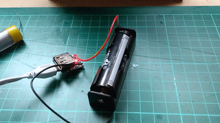

**Warning: LiPo batteries can be dangerous, and can cause chemical fires when treated incorrectly. If you have little or no experience handling them, you should use a commercial power bank with safety certification relevant for you locale.**

To make your own power bank, you will need a [charging protection board](https://www.aliexpress.com/item/5V-Step-Up-Power-Module-Lithium-Battery-Charging-Protection-Board-Boost-Converter-LED-Display-USB-For/32845254042.html), an [18650 battery](https://www.aliexpress.com/item/18650-Battery-rechargeable-18650-26FM-for-flashlight-power-bank-ICR18650-26FM-2600mAh-3-6v-charge18650-rechargeable/32839060640.html), and an [18650 battery clip](https://www.aliexpress.com/item/New-Plastic-Black-18650-Battery-Holder-3-7V-Clip-Case-With-Wire-Lead-Battery-Storage-High/32731063438.html).

You will also need access to a soldering iron and some solder.

--- task ---
Solder the black lead from the battery clip to the negative terminal of the board. Then solder the red lead to the positive terminal.

--- /task ---

--- task ---
Once you've soldered the board to the battery clip, insert an 18650 battery. Often the positive and negative terminals are not marked. The smaller metallic terminal is the positive.

The red LED should flash to indicate it is charging.

--- /task ---
